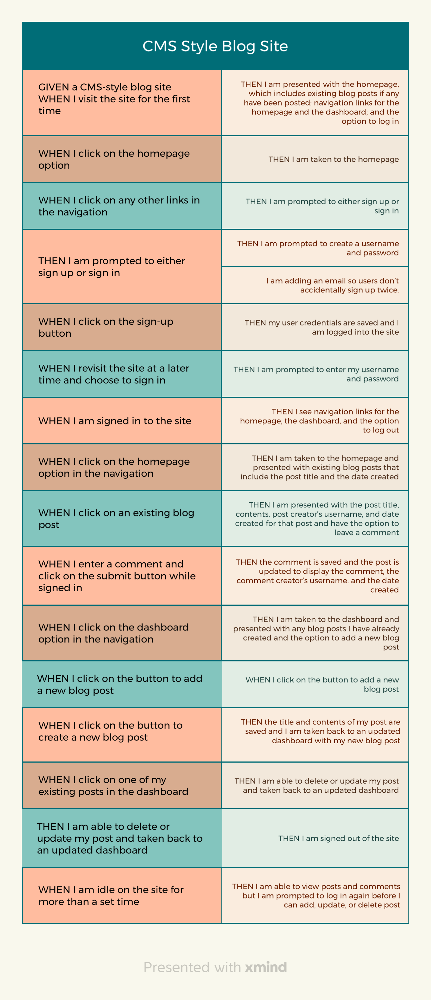

<a name="readme-top"></a>

[![Contributors][contributors-shield]][contributors-url]
[![Forks][forks-shield]][forks-url]
[![Stargazers][stars-shield]][stars-url]
[![Issues][issues-shield]][issues-url]
[![MIT License][license-shield]][license-url]
[![LinkedIn][linkedin-shield]][linkedin-url]
</br>

<br />
<div align="center">
  <a href="https://github.com/beckpull/tech-blog">


<h1 align="center">TechBlog</h1>

  <p align="center">
A CMS-style blog site similar to a Wordpress site, where developers can publish their blog posts and comment on other developers’ posts as well
    <br />
    <a href="https://github.com/beckpull/tech-blog"><strong>Explore the docs »</strong></a>
    <br />
    <br />
    <a href="https://tech-blog-ravs.onrender.com">View Page</a>
    ·
    <a href="https://github.com/beckpull/tech-blog/issues">Report Bug</a>
    ·
    <a href="https://github.com/beckpull/tech-blog/issues">Request Feature</a>
  </p>
</div>

</br>
</br>

<!-- TABLE OF CONTENTS -->
<details>
  <summary>Table of Contents</summary>
  <ol>
    <li>
      <a href="#about-the-project">About The Project</a>
      <ul>
        <li><a href="#built-with">Built With</a></li>
      </ul>
    </li>
    <li>
      <a href="#getting-started">Getting Started</a>
      <ul>
        <li><a href="#prerequisites">Prerequisites</a></li>
        <li><a href="#installation">Installation</a></li>
      </ul>
    </li>
    <li><a href="#usage">Usage</a></li>
    <li><a href="#roadmap">Roadmap</a></li>
    <li><a href="#contributing">Contributing</a></li>
    <li><a href="#license">License</a></li>
    <li><a href="#contact">Contact</a></li>
     <li><a href="#acknowledgments">Acknowledgments</a></li>
  </ol>
</details>

</br>
</br>

<!-- ABOUT THE PROJECT -->
## About The Project

**TechBlog** is a content management system (CMS) inspired by popular blogging platforms like WordPress, designed specifically for tech enthusiasts. With TechBlog, users can create an account, publish posts on various tech topics, engage in discussions through comments, and explore a vibrant community of like-minded individuals.

**Key Features:**

- **User Authentication**: Secure user authentication system allowing users to create accounts and log in securely.
- **Create and Publish Posts**: Users can easily create, edit, and publish posts on a wide range of tech-related topics.
- **Commenting System**: Engage in discussions by commenting on posts, fostering a dynamic community atmosphere.
- **Responsive Design**: Fully responsive design ensures seamless user experience across devices, from desktops to mobile devices.
- **Interactive Dashboard** : Intuitive dashboard for users to manage/update/delete their posts effortlessly. 

<p align="right">(<a href="#readme-top">back to top</a>)</p>


### Built With

* 
* ![NodeJS]
* 
* 
* 
* 


<p align="right">(<a href="#readme-top">back to top</a>)</p>

<!-- GETTING STARTED -->
## Getting Started

<p align="center"><i><strong>✨ Everything you need to know ✨</strong></i></p>

### Prerequisites

_This application has several dependencies, to install individually onto your machine, navigate to the directory this code lives in and type these commands into your Terminal / Git Bash:_
  ```sh
  npm i express
  npm i express-session
  npm i connect-session-sequelize
  npm i express-handlebars
  npm i sequelize
  npm i pg
  npm i dotenv
  npm i nodemon --save-dev
  ```

### Installation

_To get a local copy up and running follow these simple example steps:_

1. Clone the repo
   ```sh
   HTTP: git clone https://github.com/beckpull/tech-blog.git
   SSH: git clone git@github.com:beckpull/tech-blog.git
   ```
2. Install all necessary NPM packages
   ```sh
   npm i && npm run seed
   ```
3. Node `server.js`
   ```js
   npm start
   ```

<p align="right">(<a href="#readme-top">back to top</a>)</p>

<!-- USAGE EXAMPLES -->
## Usage 
</br></br>

<div align="center"> 
<strong><i>Click <a href="https://tech-blog-ravs.onrender.com">HERE</a> to view this site in action!</strong>
  </br></br>
  <p><strong></i>This is what users see upon entering the site:</i></strong></p>
      
  </br></br>
  <a href="https://github.com/beckpull/tech-blog">
   <p>Log in/Sign up</p>
    
    
  </a>
  </br></br>
  <a href="https://github.com/beckpull/tech-blog">
    <p>User Dashboard</p>
    
  </a>
  </br></br>
  <a href="https://github.com/beckpull/tech-blog">
    <p>Clicking into a post</p>
    
  </a>
</br></br>
</div>

<p align="right">(<a href="#readme-top">back to top</a>)</p>

<!-- ROADMAP -->
## Roadmap


<div align="right">
  <p><i>This was how I chose to set up my schema for this project</i></p>
</div>
</br></br></br>
<div align="center">
  
</div>
<div align="right">
  <p><i>This was my roadmap to completing all of the acceptance criteria</i></p>
</div>
<!-- GIVEN a CMS-style blog site
WHEN I visit the site for the first time
THEN I am presented with the homepage, which includes existing blog posts if any have been posted; navigation links for the homepage and the dashboard; and the option to log in
WHEN I click on the homepage option
THEN I am taken to the homepage
WHEN I click on any other links in the navigation
THEN I am prompted to either sign up or sign in
WHEN I choose to sign up
THEN I am prompted to create a username and password
WHEN I click on the sign-up button
THEN my user credentials are saved and I am logged into the site
WHEN I revisit the site at a later time and choose to sign in
THEN I am prompted to enter my username and password
WHEN I am signed in to the site
THEN I see navigation links for the homepage, the dashboard, and the option to log out
WHEN I click on the homepage option in the navigation
THEN I am taken to the homepage and presented with existing blog posts that include the post title and the date created
WHEN I click on an existing blog post
THEN I am presented with the post title, contents, post creator’s username, and date created for that post and have the option to leave a comment
WHEN I enter a comment and click on the submit button while signed in
THEN the comment is saved and the post is updated to display the comment, the comment creator’s username, and the date created
WHEN I click on the dashboard option in the navigation
THEN I am taken to the dashboard and presented with any blog posts I have already created and the option to add a new blog post
WHEN I click on the button to add a new blog post
THEN I am prompted to enter both a title and contents for my blog post
WHEN I click on the button to create a new blog post
THEN the title and contents of my post are saved and I am taken back to an updated dashboard with my new blog post
WHEN I click on one of my existing posts in the dashboard
THEN I am able to delete or update my post and taken back to an updated dashboard
WHEN I click on the logout option in the navigation
THEN I am signed out of the site
WHEN I am idle on the site for more than a set time
THEN I am able to view posts and comments but I am prompted to log in again before I can add, update, or delete posts -->

<p align="right">(<a href="#readme-top">back to top</a>)</p>

<!-- CONTRIBUTING -->
## Contributing

Contributions are what make the open source community such an amazing place to learn, inspire, and create. Any contributions you make are **greatly appreciated**!

_If you have a suggestion that would make this better, please fork the repo and create a pull request. You can also simply open an issue with the tag "enhancement".
Don't forget to give the project a star! Thanks again!_

1. Fork the Project
2. Create your Feature Branch (`git checkout -b feature/NewFeature`)
3. Commit your Changes (`git commit -m 'Added ______ , NewFeature'`)
4. Push to the Branch (`git push origin feature/NewFeature`)
5. Open a Pull Request

See the [open issues](https://github.com/beckpull/tech-blog/issues) for a full list of proposed features (and known issues).

<p align="right">(<a href="#readme-top">back to top</a>)</p>

<!-- LICENSE -->
## License

<p align='center'>Distributed under the MIT License. See `LICENSE.txt` for more information.</p>
<p align='center'>© Beck Feltman · All rights reserved.</p>

<p align="right">(<a href="#readme-top">back to top</a>)</p>

<!-- CONTACT -->
## Contact

**Rebecca Feltman** - [Email me](mailto:beckpull@icloud.com) - or check me out on [GitHub!](https://github.com/beckpull) 

>Repository Link: [https://github.com/beckpull/tech-blog](https://github.com/beckpull/tech-blog)


<p align="right">(<a href="#readme-top">back to top</a>)</p>

<!-- ACKNOWLEDGMENTS -->
## Acknowledgments

* This README file template was created by [@othneildrew](https://github.com/othneildrew) - the original can be found [here](https://github.com/othneildrew/Best-README-Template)
* Huge thank you to my friend [@NathaliaReyes](https://github.com/nathaliareyes) for all of your help, support, and collaboration through this project ✨

#### Disclaimer: 
> I utilized several articles from sources such as (but not limited to) Stack Overflow, W3Schools, and MDN Web Docs, as well as many classwork example code from the University of Denver (relied heavily on DU materials for => userRoutes.js, login/signup.js/.handlebars, postFormHandlers, etc. ) **as references** for the javascript code attached. 
>
**All of the utilized information has been altered in order to fit this project. This repository contains _solely_ my own work.** 
<p align="right">(<a href="#readme-top">back to top</a>)</p>


<!-- MARKDOWN LINKS & IMAGES -->
<!-- https://www.markdownguide.org/basic-syntax/#reference-style-links -->
[contributors-shield]: https://img.shields.io/github/contributors/beckpull/tech-blog.svg?style=for-the-badge
[contributors-url]: https://github.com/beckpull/tech-blog/graphs/contributors
[forks-shield]: https://img.shields.io/github/forks/beckpull/tech-blog.svg?style=for-the-badge
[forks-url]: https://github.com/beckpull/tech-blog/network/members
[stars-shield]: https://img.shields.io/github/stars/beckpull/tech-blog.svg?style=for-the-badge
[stars-url]: https://github.com/beckpull/tech-blog/stargazers
[issues-shield]: https://img.shields.io/github/issues/beckpull/tech-blog.svg?style=for-the-badge
[issues-url]: https://github.com/beckpull/tech-blog/issues
[license-shield]: https://img.shields.io/github/license/beckpull/tech-blog.svg?style=for-the-badge
[license-url]: https://github.com/beckpull/tech-blog/blob/main/LICENSE
[product-screenshot]: images/screenshot.png
[NodeJS]: https://img.shields.io/badge/node.js-6DA55F?style=for-the-badge&logo=node.js&logoColor=white
[Node-url]: https://nodejs.org/en
[JQuery.com]: https://img.shields.io/badge/jQuery-0769AD?style=for-the-badge&logo=jquery&logoColor=white
[JQuery-url]: https://jquery.com 
[Bulma]: https://img.shields.io/badge/bulma-00D0B1?style=for-the-badge&logo=bulma&logoColor=white
[linkedin-shield]: https://img.shields.io/badge/linkedin-%230077B5.svg?style=for-the-badge&logo=linkedin&logoColor=white
[linkedin-url]: https://linkedin.com/in/beckpull/
[stackoverflow-shield]: https://img.shields.io/badge/-Stackoverflow-FE7A16?style=for-the-badge&logo=stack-overflow&logoColor=white
[jest-shield]: https://img.shields.io/badge/-jest-%23C21325?style=for-the-badge&logo=jest&logoColor=white
[inquirer-shield]: https://img.shields.io/badge/dependency-inquirer-black
[inquirer-url]: https://www.npmjs.com/package/inquirer
